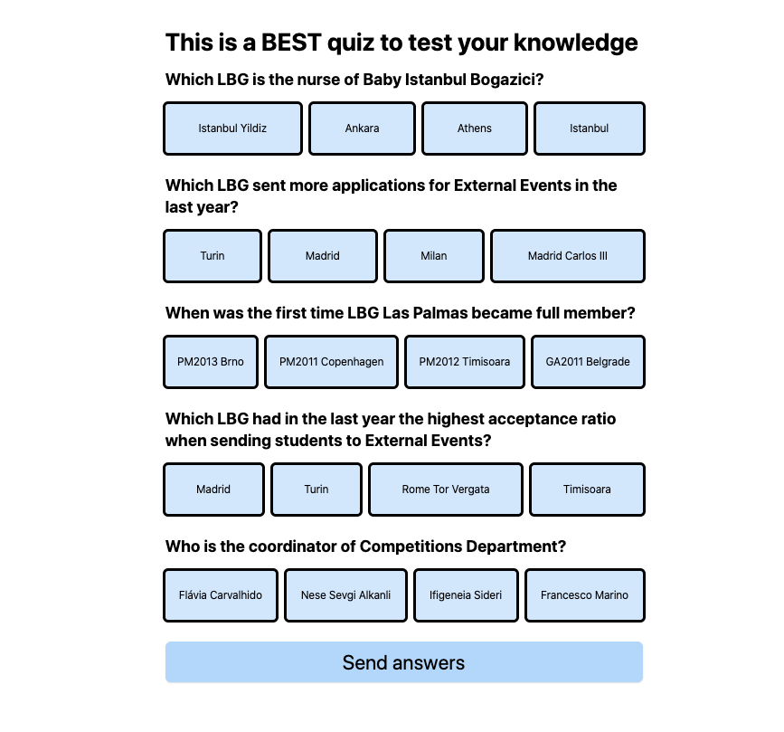
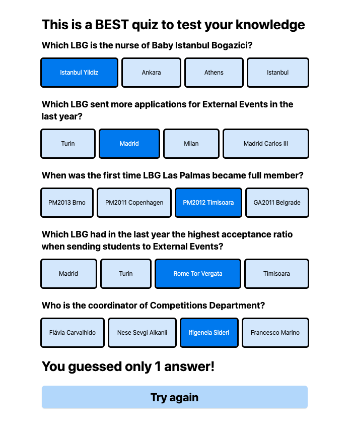
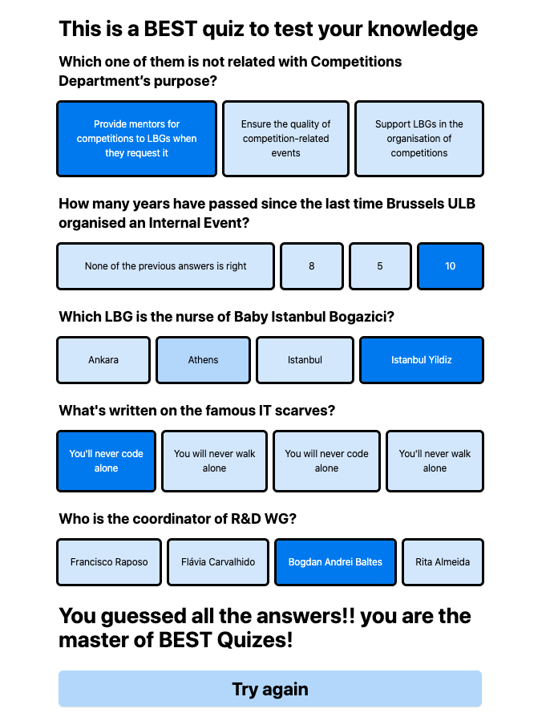

# Design

This design is just here as an example of how the quiz could look like.

With every request to `/questions` you receive 5 questions and their possible answers:

The user should click on one answer per question (clicking a second answer would unmark the first answer):

When you send the answers to the questions, the backend will answer with the number of answers you guessed right. It would be nice to show how many they got right:

Then, it should offer the option to restart the quiz. If they manage to get all questions right, you can show something different:

